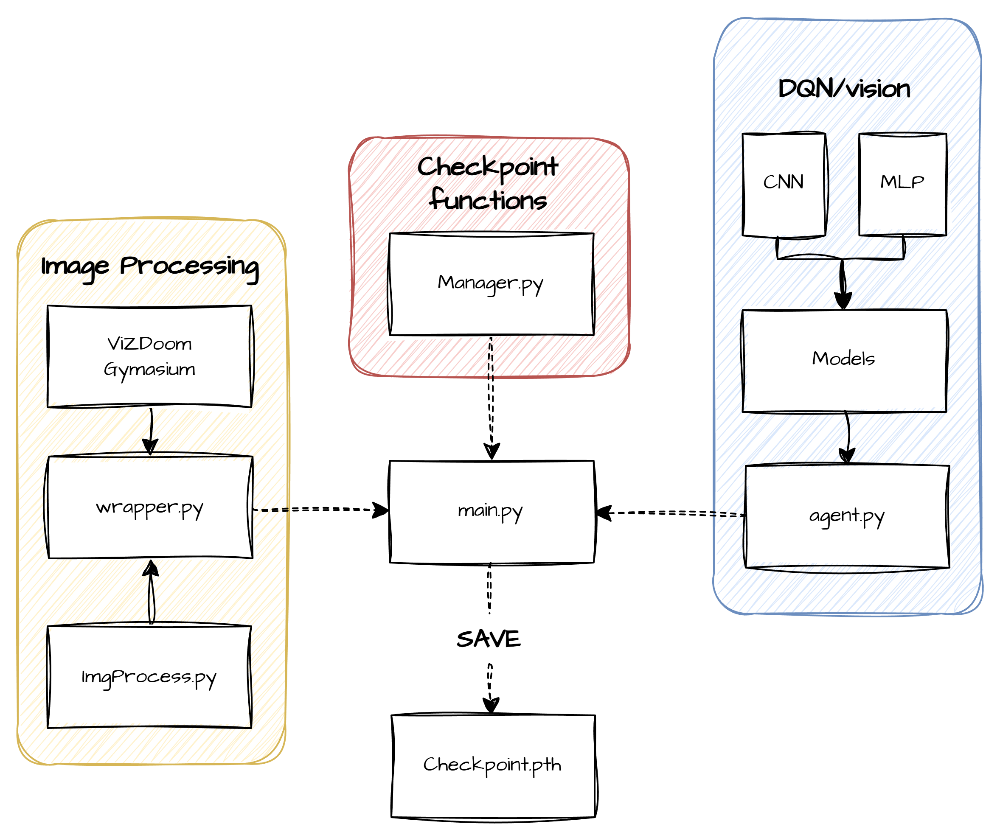
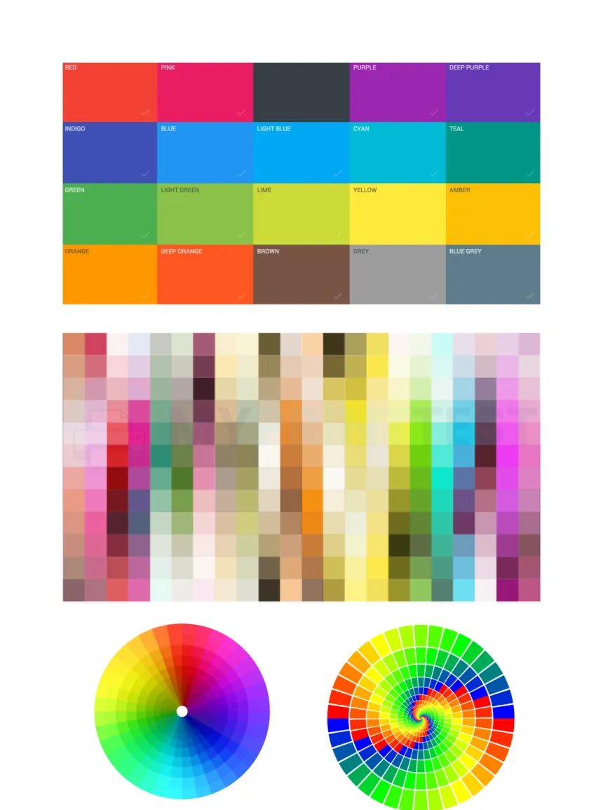
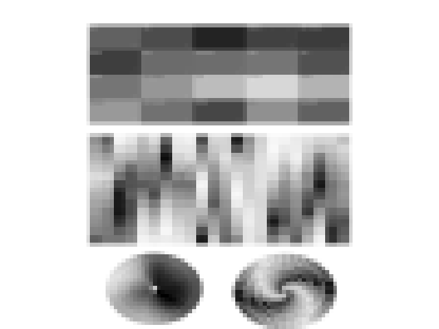
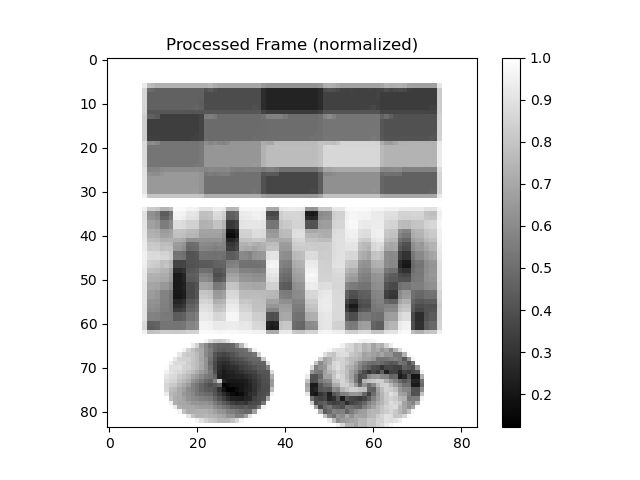

# RL - project

Last edited time: February 7, 2026 9:20 PM
Status: Not started

# 1. Overview: Visual Reinforcement Learning Agent

---

## 1  Objective

The project involves the development of a **reinforcement learning system integrated with a convolutional neural network**. 
The system uses **raw visual data**, represented as pixel matrices, as input states, allowing the agent to learn an effective representation of the environment directly from images, without relying on a manual feature-extraction phase.

---

# 2. Methodology and Procedure

The adopted methodology is **Deep Reinforcement Learning (DRL)**, with a **model-free approach** based on convolutional neural networks.

## 2.1 Definition of the State (State Space)

The state **is not a single image**, but a temporal representation of the environment. Specifically:

- **Data type:** Four-dimensional tensor $(N, C, H, W)$, representing both the spatial dimensions of the images and the temporal sequence of frames.
- **Visual state:** Resized images (es. $84 \times 84$ pixel) to standardize the input and reduce computational load..
- **Temporality (Frame Stacking):** The state consists of k consecutive frames (typically $k=4$) to capture **velocity, direction, and temporal dynamics,** addressing the problem of **partial observability**.
- **Preprocessing:** Conversion to **grayscale** to reduce complexity, and **normalization**. $[0, 1]$ and **cropping of non-informative areas** (e.g., HUD or image borders).

## 2.2 **Action Space**

- Turn Left
- Turn Right
- Shoot
- Nothing

## 2.3 Reward Function

The reward function is internal to the environment, so no explicit reward is provided.

---

# 3. RL Architecture

- **Encoder CNN (Convolutional Neural Network):** Three or more convolutional layers to compress the pixels into **a feature vector**.
- **Controller MLP (Multi-Layer Perceptron)**: Receives the feature vector and estimates the action with the highest expected value.

---

# 4. **Brief Roadmap**

- **Environment:** Set up **ViZDoom** to generate images and provide the reward function.
- **Wrapper:** Python class that captures frames, converts them to **grayscale**, resizes them, stacks them, and organizes them into a **tensor**.
- **Agent:** Uses the models to estimate the action according to the defined policy.
- **Training:** Observation → action → reward → **CNN weights update** cycle.
- **Save:** Saving **model checkpoints**.



---

# 5. Pipeline

## 5.1 Image Processing

The files dedicated to **image processing** contain the functions necessary to transform the frames captured from the environment into inputs usable by the neural network. In particular, they leverage the **OpenCV library** to perform the operations described in the previous section, converting the images into a **standardized representation** compatible with the deep learning model.

```python
import cv2
import numpy as np

class FrameProcessor:
    def __init__(self, target_h=84, target_w=84, to_grayscale=True, normalize=True):
        self.h = target_h
        self.w = target_w
        self.to_grayscale = to_grayscale
        self.normalize = normalize

    def process(self, frame):
        # 1. Input Validation: if img is empty we raise an error
        if frame is None:
            raise ValueError("FrameProcessor ha ricevuto un frame vuoto!")
        
        # 2. Grayscale conversion
        if self.to_grayscale and len(frame.shape) == 3:
            # Formula standard OpenCV per la luminanza
            frame = cv2.cvtColor(frame, cv2.COLOR_RGB2GRAY)
        
        # 3. Resize: INTER_AREA to not lose details
        frame = cv2.resize(frame, (self.w, self.h), interpolation=cv2.INTER_AREA)

				# 4. (Channel First)
				# If grayscale: (84, 84) -> (1, 84, 84).
				# Note: Apparently, ViZDoom does this automatically with frame stacking.
				# To prevent errors, the frame vector is squeezed before frame stacking.
				# This way, we won't end up with (4, 1, 84, 84)
        if len(frame.shape) == 2:
            frame = np.expand_dims(frame, axis=0)
        # Se fosse rimasto a colori (84, 84, 3), lo giriamo a (3, 84, 84)
        elif len(frame.shape) == 3:
            frame = np.transpose(frame, (2, 0, 1))
        if self.normalize:
            return frame.astype(np.float32)/255
        else:
            frame = frame.astype(np.uint8)
        return frame
```

It is possible to visualize the result by **creating an instance of the class** and providing it with a **test image** as input. The output can then be **plotted to verify correctness**: the network will see an **$84 × 84$ matrix** of values **normalized in the range $[0, 1]$**.

```python
import cv2
import numpy as np
from ImgProcess import FrameProcessor
import matplotlib.pyplot as plt
# 1. loading image 
img = cv2.imread("test.png")
# BGR -> RGB
img = cv2.cvtColor(img, cv2.COLOR_BGR2RGB)
# 2. processor init
processor = FrameProcessor(target_h=84, target_w=84, to_grayscale=True,normalize=True)
# 3. output
processed = processor.process(img)
plt.figure(frameon=False)
plt.imshow(processed[0], cmap="gray")
plt.axis("off")
plt.subplots_adjust(left=0, right=1, top=1, bottom=0)
plt.show()   
plt.imshow(processed[0], cmap="gray")
plt.colorbar()
plt.title("Processed Frame (normalized)")
plt.show()
```

Input image



output image





## 5.2 Wrapper

The wrapper acts as a **bridge between the image processor and the specific environment** (in this case, ViZDoom). If in the future a different environment, such as Mario, were to be used, **only the wrapper would need to be modified**, while the **`FrameProcessor` would remain unchanged**.

```python
import gymnasium as gym
from gymnasium import spaces
import numpy as np
# Importiamo il nostro modulo generico
from ImgProcess import FrameProcessor

class VisualAdapter(gym.ObservationWrapper):
    def __init__(self, env, target_h=84, target_w=84, grayscale=True,normalize=True):
        super().__init__(env)
        
        # Init frameprocessor
        self.processor = FrameProcessor(target_h, target_w, grayscale,normalize)
        
        # calculate the number of channels
        c_channels = 1 if grayscale else 3
        
        # Define Obervation frame for the agent
        self.observation_space = spaces.Box(
            low=0, 
            high=1, 
            #shape=(c_channels, target_h, target_w),
            shape=(target_h, target_w), 
            dtype=np.float32
        )

    def observation(self, observation):
        """
        Here we define the observation specifically for Vizdoom
        """
        if isinstance(observation, dict):
            frame = observation.get("screen", observation) # search for keyword "screen"
        else:
            frame = observation
        processed = self.processor.process(frame)
        return processed.squeeze()
    
```

The current code processes a **single preprocessed frame** (dimensions **$1 × 84 × 84$**); to capture the **temporal dynamics** of the environment, the process needs to be **extended to handle sequences of consecutive frames**.

Instead of implementing custom code, we will use the **standard Gym wrapper**:

```python
gym.wrappers.FrameStack
```

This wrapper directly generates the **final tensor** with dimensions **$(4, 84, 84)$**. Essentially, it is equivalent to **stacking four matrices into a single tensor**, or visually, **creating a “cube” composed of four slices along the temporal dimension**.

## 5.3 Network Backbone

We will build the architecture in a **modular way**, separating the **Encoder (CNN)**, responsible for extracting features from the frames, from the **Controller (DQN)**, which uses these features to estimate actions according to the agent’s policy. The two models will be implemented in **separate classes**, and a **final class** will handle instantiating them and connecting them together.

### 5.3.1 Encoder

This module receives as input a tensor with dimensions **$(Batch, 4, 84, 84)$** and compresses it into a **feature vector**.

**Educational concept:** Imagine the pixels as thousands of tiny dots. The **`Conv2d` layers (convolutional layers)** look for patterns:

- **First layer** detects edges and lines.
- **Second layer** recognizes more complex shapes, like circles and corners.
- Th**ird layer** identifies objects or structured combinations of shapes.

At the end, the output is **flattened** into a numerical vector that summarizes all the relevant information.

**Key parameters of a convolutional layer:**

- **in_channels:** number of input channels.
- **out_channels:** number of output channels, i.e., how many filters the layer applies.
- **kernel_size:** size of the convolutional filter, which scans the image in blocks of `kernel_size × kernel_size` pixels.
- **stride:** step size of the filter as it moves across the image.

**Example:**

```python
nn.Conv2d(in_channels=32, out_channels=64, kernel_size=4, stride=2)
```

**In this case:**

- The input has **32 channels**.
- The layer applies **64 filters** of size **4×4**.
- The filter moves **2 pixels at a time**.
- The output consists of **64 feature maps**, ready for further processing.

```python
import torch
import torch.nn as nn
import numpy as np

class VisualEncoder(nn.Module):
    def __init__(self, input_shape, output_dim=512):
        super(VisualEncoder, self).__init__()
        
        # input_shape (C, H, W), es: (4, 84, 84)
        c, h, w = input_shape
        
        # 3 total Layers
        self.conv = nn.Sequential(
            # Layer 1: find edges
            nn.Conv2d(in_channels=c, out_channels=32, kernel_size=8, stride=4),
            nn.ReLU(),
            
            # Layer 2: complex shapes
            nn.Conv2d(in_channels=32, out_channels=64, kernel_size=4, stride=2),
            nn.ReLU(),
            
            # Layer 3: specific details
            nn.Conv2d(in_channels=64, out_channels=64, kernel_size=3, stride=1),
            nn.ReLU()
        )
        # Extract the dimension of the flattened output:
        # we give a "fake" input and calculate the shape
        with torch.no_grad():
            dummy_input = torch.zeros(1, c, h, w)
            conv_out = self.conv(dummy_input)
            self.flatten_dim = conv_out.view(1, -1).size(1)
            
        # Final layer, flattening to a desired number of features
        self.fc = nn.Linear(self.flatten_dim, output_dim)
        self.relu = nn.ReLU()

    def forward(self, x):
        x = self.conv(x)
        # flattening 
        x = x.view(x.size(0), -1)
        # Compression
        x = self.relu(self.fc(x))
        return x
```

- Input: x -> (B, 4, 84, 84)
- Conv layers -> (B, 64, 7, 7)
- x.view -> (B, 3136)
- Fully connected -> (B, 512)
- ReLU -> (B, 512)

### 5.3.2 La Head (DQN)

This module takes the **summary produced by the CNN** and decides which action to take.

**Educational concept:** This is a classic **fully connected (dense) neural network**. It receives as input a **512-dimensional vector** representing the scene (for example, “there is an enemy on the right”) and calculates a **Q-value** for each possible controller command.

The **selected action** is the one with the **highest Q-value**: for instance, if the value associated with “Shoot” is the highest, the agent executes the **shooting action**.

```python
class DQNHead(nn.Module):
    def __init__(self, input_dim=512, n_actions=5):
        super(DQNHead, self).__init__()
        
        self.net = nn.Sequential(
            nn.Linear(input_dim, 512),
            nn.ReLU(),
						nn.Linear(512, n_actions)
        )

    def forward(self, x):
        return self.net(x)
```

### 5.3.3 Assembly

At this stage, we **combine the modules**. The modular approach allows the **Controller to be easily replaced**: for example, the **`DQNHead`** can be detached and a **`PPOHead`** connected in the future, without needing to modify the **Encoder (CNN)**.

```python
class DoomAgent(nn.Module):
    def __init__(self, input_shape, n_actions):
        super(DoomAgent, self).__init__()
        # 1. (CNN)
        self.encoder = VisualEncoder(input_shape=input_shape)
        # 2. (DQN)
        self.head = DQNHead(input_dim=512, n_actions=n_actions)

    def forward(self, x):       
        features = self.encoder(x)
        q_values = self.head(features)
        return q_values
```

### 5.4 Agent

This class represents the **decision-making core of the agent** and implements the **Deep Q-Learning** mechanism. Within it, actions are computed and the parameters that guide the agent’s behavior are updated.

A key element of the **DQN algorithm** is the use of **two separate but structurally identical neural networks**, each serving a different purpose:

- **Policy Network:** The active network, used to select actions and continuously optimized during the learning phase.
- **Target Network:** A temporarily fixed version of the network, used to estimate target values during updates. Its use reduces training instabilities that would arise if the network were updated using its own constantly changing estimates as references.

At regular intervals, the parameters of the **Policy Network** are copied to the **Target Network**, updating the reference model while preserving the stability of the learning process.

```python
class DQNAgent:
    def __init__(self, state_shape, n_actions, lr=1e-4, gamma=0.99, epsilon_start=1.0, epsilon_end=0.02, epsilon_decay=10000):
        self.n_actions = n_actions 
        self.gamma = gamma  # Fattore di sconto 
        self.device = torch.device("cuda" if torch.cuda.is_available() else "cpu")
        
        # --- Iperparametri per Epsilon-Greedy ---
        self.epsilon = epsilon_start
        self.epsilon_end = epsilon_end
        self.epsilon_decay = epsilon_decay
        self.steps_done = 0

        # --- Creazione dei Cervelli ---
        # 1. Policy Net:
        self.policy_net = DoomAgent(state_shape, n_actions).to(self.device)
        # 2. Target Net:
        self.target_net = DoomAgent(state_shape, n_actions).to(self.device)
        # Allineiamo i pesi della target con la policy
        self.target_net.load_state_dict(self.policy_net.state_dict())
        self.target_net.eval()  # La target net non deve mai andare in training mode
        # Ottimizzatore
        self.optimizer = optim.Adam(self.policy_net.parameters(), lr=lr)

    def select_action(self, state):
        """
        Sceglie l'azione usando la strategia Epsilon-Greedy.
        Input: state (numpy array 4x84x84)
        """
        # Step update
        self.steps_done += 1
        # Epsilon decay
        self.epsilon = max(self.epsilon_end, self.epsilon - (1.0 - self.epsilon_end) / self.epsilon_decay)

        # exploration (azione casuale)
        if random.random() < self.epsilon:
            return random.randrange(self.n_actions)
        # otherwise 
        with torch.no_grad():
            # Trasformo l'input in tensore PyTorch e aggiungo la dimensione batch (da 4x84x84 a 1x4x84x84)
            state_tensor = torch.FloatTensor(state).unsqueeze(0).to(self.device)
            q_values = self.policy_net(state_tensor)
            # Prendo l'indice dell'azione con il valore più alto
            return q_values.argmax().item()

    def learn(self, memory, batch_size=32):
        """
        Il cuore dell'addestramento: aggiornamento pesi tramite Backpropagation.
        """
        # Se non ho abbastanza ricordi, non faccio nulla
        if len(memory) < batch_size:
            return
        # 1. Recupero un batch di esperienze dalla memoria
        states, actions, rewards, next_states, dones = memory.sample(batch_size)

        # Converto tutto in tensori GPU/CPU
        states = torch.FloatTensor(states).to(self.device)
        actions = torch.LongTensor(actions).unsqueeze(1).to(self.device) # unsqueeze serve per le operazioni matriciali
        rewards = torch.FloatTensor(rewards).to(self.device)
        next_states = torch.FloatTensor(next_states).to(self.device)
        dones = torch.FloatTensor(dones).to(self.device)

        # 2. CALCOLO IL VALORE ATTUALE di Q (Predetto dalla Policy Net)
        # seleziona solo il Q-value dell'azione effettivamente presa
        current_q_values = self.policy_net(states).gather(1, actions).squeeze(1)

        # 3. CALCOLO IL VALORE ATTESO (Target Net + Ricompensa reale)
        with torch.no_grad():
            next_q_values = self.target_net(next_states).max(1)[0]
            # Se done=1 (gioco finito), non c'è futuro, quindi il valore è solo la reward
            expected_q_values = rewards + (self.gamma * next_q_values * (1 - dones))

        # 4. CALCOLO LA PERDITA (LOSS)
        loss = F.smooth_l1_loss(current_q_values, expected_q_values)

        # 5. AGGIORNAMENTO PESI (Backpropagation)
        self.optimizer.zero_grad() # Resetta i gradienti vecchi
        loss.backward()            # Calcola i nuovi gradienti (quanto ogni peso ha contribuito all'errore)
        
        # Gradient Clipping: evita che i gradienti esplodano (molto utile con le CNN)
        for param in self.policy_net.parameters():
            param.grad.data.clamp_(-1, 1)
            
        self.optimizer.step()      # Applica le modifiche ai pesi

    def update_target_network(self):
        """Copia i pesi dalla Policy alla Target. Da chiamare ogni N step."""
        self.target_net.load_state_dict(self.policy_net.state_dict())
```

## 5.5 Director

This is the **final stage of the system**. The `main.py` file acts as the **central coordinator**, orchestrating all the developed components: the **simulation environment** (ViZDoom), the **visual perception module** (Wrapper), the **experience memory** (Replay Buffer), and the agent’s **decision-making module** (Agent).

```python
import gymnasium as gym
from gymnasium.wrappers import FrameStack
import torch
import numpy as np
import matplotlib.pyplot as plt

# Importiamo i moduli che abbiamo costruito
from wrappers import VisualAdapter
from agent import DQNAgent, ReplayBuffer

# --- 1. IPERPARAMETRI (Il pannello di controllo) ---
BATCH_SIZE = 32         # Quante esperienze l'IA ripassa ogni volta [cite: 102]
GAMMA = 0.99            # Quanto conta il futuro (0.99 = molto lungimirante)
EPS_START = 1.0         # Curiosità iniziale (100% casuale)
EPS_END = 0.02          # Curiosità finale (2% casuale)
EPS_DECAY = 10000       # Quanto velocemente smette di esplorare
LR = 1e-4               # Learning Rate: velocità di apprendimento
TARGET_UPDATE = 1000    # Ogni quanti step aggiorniamo la "Target Network"
MEMORY_SIZE = 10000     # Dimensione del diario dei ricordi
NUM_EPISODES = 500      # Quante partite far giocare
MAX_STEPS = 2000        # Durata massima di una partita (per evitare loop infiniti)

def make_env(scenario="VizdoomBasic-v0"):
    """
    Funzione Factory per assemblare l'ambiente con i pezzi Lego.
    """
    # 1. Crea l'ambiente base (assumiamo che gym-vizdoom sia installato)
    # Nota: Se usi la libreria vizdoom diretta, il codice di init cambia leggermente,
    # ma la logica dei wrapper resta identica.
    env = gym.make(scenario)
    
    # 2. Applica gli 'occhiali' (VisualAdapter)
    # Ridimensiona a 84x84 e converte in scala di grigi [cite: 91, 130]
    env = VisualAdapter(env, target_h=84, target_w=84, grayscale=True)
    
    # 3. Applica la memoria temporale (FrameStack)
    # Impila 4 frame consecutivi per dare il senso del movimento [cite: 65, 66]
    # Output finale: Tensore (4, 84, 84)
    env = FrameStack(env, num_stack=4)
    
    return env

def main():
    # --- 2. INIZIALIZZAZIONE ---
    print("Inizializzazione Ambiente...")
    env = make_env()
    
    # Recuperiamo le dimensioni automatiche
    # shape sarà (4, 84, 84) come definito nel progetto [cite: 63]
    state_shape = env.observation_space.shape 
    n_actions = int(env.action_space.n)
    
    print(f"Stato: {state_shape}, Azioni: {n_actions}")
    print("Inizializzazione Agente...")
    
    # Creiamo il cervello e la memoria
    agent = DQNAgent(state_shape, n_actions, lr=LR, gamma=GAMMA, 
                     epsilon_start=EPS_START, epsilon_end=EPS_END, 
                     epsilon_decay=EPS_DECAY)
    
    memory = ReplayBuffer(capacity=MEMORY_SIZE)
    
    rewards_history = [] # Per tracciare i progressi
    global_step_count = 0

    # --- 3. TRAINING LOOP  ---
    for episode in range(NUM_EPISODES):
        
        # Reset dell'ambiente all'inizio della partita
        # Gym restituisce (osservazione, info)
        state, _ = env.reset()
        
        # In Gym il FrameStack restituisce un LazyFrame, lo convertiamo in array numpy
        state = np.array(state) 
        
        total_reward = 0
        done = False
        
        for step in range(MAX_STEPS):
            global_step_count += 1
            
            # A. SCEGLIERE L'AZIONE
            # L'agente decide se esplorare o sfruttare
            action = agent.select_action(state)
            
            # B. ESEGUIRE L'AZIONE NELL'AMBIENTE
            # step() restituisce 5 valori:
            # next_state: la nuova immagine (4, 84, 84)
            # reward: punti ottenuti (+1, -0.1, etc) [cite: 79, 80]
            # terminated: gioco finito (vittoria/morte)
            # truncated: tempo scaduto
            # info: dati extra
            next_state, reward, terminated, truncated, _ = env.step(action)
            
            # Uniamo i due tipi di "fine gioco"
            done = terminated or truncated
            next_state = np.array(next_state)

            # C. MEMORIZZARE L'ESPERIENZA
            memory.push(state, action, reward, next_state, done)
            
            # Avanziamo di stato
            state = next_state
            total_reward += reward
            
            # D. IMPARARE (Training Step)
            # Aggiornamento pesi della CNN e del MLP 
            agent.learn(memory, BATCH_SIZE)
            
            # E. AGGIORNARE LA TARGET NETWORK
            # Ogni tanto, stabilizziamo la conoscenza
            if global_step_count % TARGET_UPDATE == 0:
                agent.update_target_network()
            
            if done:
                break
        
        # --- LOGGING ---
        rewards_history.append(total_reward)
        avg_reward = np.mean(rewards_history[-10:]) # Media ultime 10 partite
        
        print(f"Episodio {episode}/{NUM_EPISODES} | "
              f"Reward: {total_reward:.2f} | "
              f"Avg 10: {avg_reward:.2f} | "
              f"Epsilon: {agent.epsilon:.4f}")

    print("Addestramento completato!")
    env.close()
    
    # Plot finale per vedere se ha imparato
    plt.plot(rewards_history)
    plt.title("Curva di Apprendimento Doom")
    plt.xlabel("Episodi")
    plt.ylabel("Reward Totale")
    plt.show()

if __name__ == "__main__":
    main()
```

**1. `make_env`**

In this function, the project’s **modular philosophy** is applied. The process starts from a **raw environment**, to which the **VisualAdapter** (responsible for preprocessing operations such as resizing and grayscale conversion) and the **FrameStack**, which introduces temporal memory, are progressively added.

The final result is an environment that provides the agent exclusively with **preprocessed tensors of size (4, 84, 84)**, ensuring a **clean and uniform input**.

**2. Training loop: `for step in range(MAX_STEPS)`**

This loop represents the **operational core of training**. At each iteration, the following fundamental phases occur:

- the agent observes the current state in the form of pixels,
- selects and executes an action,
- the environment returns the new state and the reward,
- the experience is stored in the buffer,
- the neural network weights are updated via **backpropagation**.

## 5.6 save and replay

In **Reinforcement Learning**, it is crucial to save the **Best Model**, i.e., the model that achieves the highest score during training. The training process can be unstable: performance may fluctuate, and an effective model may degrade in the later stages of learning. Saving the best configuration therefore makes it possible to preserve a **winning policy**, regardless of how training evolves afterward.

For this reason, it is useful to design a **dedicated model-saving system** and an **evaluation script** (“Cinema”) that allows the agent to be observed in action using the best model.

To this end, a new file called **`manager.py`** is created. This class is responsible for:

- initializing and managing the **save directory**,
- saving the model weights in **PyTorch `.pth` format**,
- keeping track of the **best-performing model**.

```python
import torch
import os

class ModelHandler:
    def __init__(self, save_dir="checkpoints"):
        self.save_dir = save_dir
        if not os.path.exists(save_dir):
            os.makedirs(save_dir)

    def save_best(self, agent, reward):
        """Salva il modello come il migliore trovato finora."""
        path = os.path.join(self.save_dir, "best_doom_model.pth")
        torch.save(agent.policy_net.state_dict(), path)
        print(f"--- Modello salvato con reward: {reward:.2f} ---")

    def load(self, agent, filename="best_doom_model.pth"):
        """Carica i pesi nel cervello dell'agente."""
        path = os.path.join(self.save_dir, filename)
        if os.path.exists(path):
            agent.policy_net.load_state_dict(torch.load(path, map_location=agent.device))
            agent.target_net.load_state_dict(agent.policy_net.state_dict())
            print(f"--- Modello {filename} caricato correttamente! ---")
            return True
        print("--- Nessun salvataggio trovato. ---")
        return False
```

Create a file called **`enjoy.py`**. This script will:

- **Load the previously saved model**,
- **Completely disable exploration** by setting **ϵ = 0**,
- Launch the environment in **full-screen rendering mode**, allowing you to **observe the agent’s behavior during execution**.

It essentially turns the system into a **playback/evaluation mode**, where the agent acts purely according to the learned policy without random actions.

```python
import time
import torch
import numpy as np
from main import make_env  # Riutilizziamo la tua funzione factory
from agent import DQNAgent
from manager import ModelHandler

def watch_agent():
    # 1. Setup Ambiente (Assicurati render_mode="human")
    env = make_env() 
    state_shape = env.observation_space.shape
    n_actions = env.action_space.n

    # 2. Setup Agente (Epsilon a zero perché vogliamo solo vedere cosa sa fare)
    agent = DQNAgent(state_shape, n_actions, epsilon_start=0.0, epsilon_end=0.0)
    
    # 3. Caricamento pesi
    handler = ModelHandler()
    if not handler.load(agent):
        print("Errore: devi prima addestrare il modello e salvarlo!")
        return

    # 4. Loop di visione
    for episode in range(5): # Guardiamo 5 partite
        state, _ = env.reset()
        state = np.array(state).squeeze(1) # Correzione dimensione che abbiamo discusso
        done = False
        total_reward = 0

        while not done:
            # L'agente usa solo la sua testa (no mosse a caso)
            action = agent.select_action(state)
            
            next_state, reward, term, trunc, _ = env.step(action)
            state = np.array(next_state).squeeze(1)
            done = term or trunc
            total_reward += reward
            
            # Rallentiamo un filo per goderci la scena
            time.sleep(0.02) 

        print(f"Partita {episode+1} finita. Reward: {total_reward}")
    
    env.close()

if __name__ == "__main__":
    watch_agent()
```

---

# 6. FootNote

## 1.1 Image Processing

### 1.1 Il Tensore Quadridimensionale $(N, C, H, W)$

Quando catturi un'immagine, hai dei dati grezzi. Per darli in pasto a una rete neurale (specialmente in PyTorch), devi organizzarli in un formato matematico preciso chiamato Tensore:

- $N$ (Batch Size): È il numero di "esperienze" che la rete guarda contemporaneamente durante l'addestramento (es. 32 o 64 sequenze di immagini).
- $C$ (Channels): Qui sta il trucco. Se usiamo il Frame Stacking, i "canali" non sono più i colori (RGB), ma i frame temporali. Se stackiamo 4 frame in bianco e nero, $C$ sarà 4.
- $H$ (Height) & $W$ (Width): L'altezza e la larghezza in pixel (es. 84x84).

In sintesi: Per l'IA, lo stato è un "cubo" di informazioni dove ogni fetta è un momento diverso nel tempo.

### 1.2 Preprocessing: Trasformare i Pixel in Informazione

I pixel grezzi contengono troppo rumore. Ecco come li puliamo>

- Cropping (Ritaglio)
    - **Perchè?:** Riduce il numero di dati da processare e impedisce alla rete di "fissarsi" su elementi statici
- Grayscale (Scala di Grigi)
    - **Perchè?:** Riduce il numero di dati passando da 3 canali (RGB) ad 1 canale, La distinzione dei colori è computazionalmente costosa. Se il colore non è una variabile decisionale critica, lo eliminiamo
- Normalizzazione $[0, 1]$: I pixel originali sono uint8 (interi da 0 a 255). Li convertiamo in float32 e dividiamo per 255.
    - **Perchè:** Le funzioni di attivazione delle reti neurali (come ReLU o Sigmoid) lavorano meglio con input piccoli. Valori come "255" farebbero "esplodere" i gradienti, rendendo l'addestramento instabile o impossibile.

### 1.3 Temporalità: Il Frame Stacking ($k=4$)

Questo è il concetto più profondo. Una singola foto (frame statico) è un MDP (Markov Decision Process) incompleto, 

L'esempio del proiettile:

- Se vedi una foto di un proiettile a mezz'aria, non sai se sta venendo verso di te o se si sta allontanando. Non conosci la sua velocità.
- Se vedi 4 frame consecutivi, la rete neurale può confrontare la posizione del proiettile tra il frame 1 e il frame 4. La differenza di posizione nei pixel indica direzione e velocità.

Sovrapponendo i frame, trasformiamo una serie di immagini statiche in un flusso dinamico che contiene la fisica dell'ambiente.

### 1.4 Rappresentazione Visiva dello Stato

Immagina lo stato finale che inviamo alla rete:

- Prendi il frame attuale, taglia l'arma, fallo 84x84, trasformalo in grigio.
- Mettilo in una "coda" (buffer) insieme ai 3 frame precedenti.
- Unisci tutto in un unico blocco di dati.

**Risultato:** Un oggetto matematico che dice all'IA: "Ecco come appaiono le cose adesso e come si sono mosse negli ultimi frazioni di secondo".

Senza questo processo, la rete vedrebbe solo "rumore colorato". Con questo processo, la rete riceve segnali di movimento.
